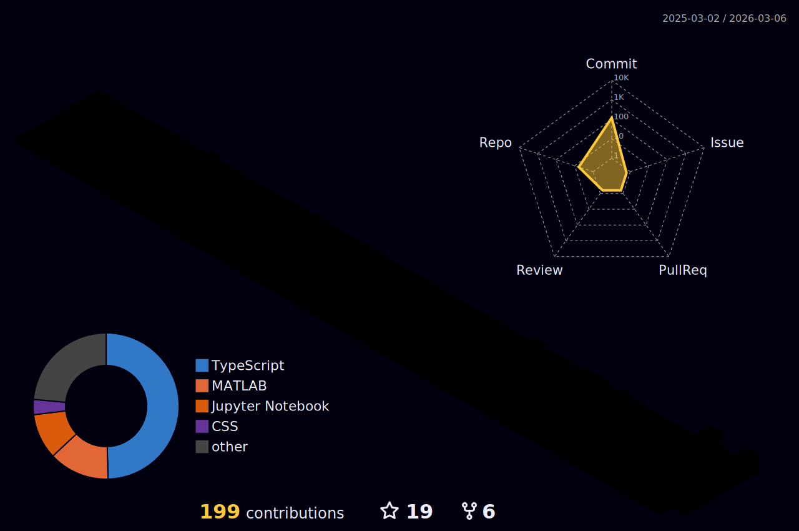

---version3---

  

  

<h3 align="left">Connect with me:</h3>

  

  

 

  

  <picture>
    <source media="(prefers-color-scheme: dark)" srcset="https://raw.githubusercontent.com/Sithumsankajith/Sithumsankajith/output/github-contribution-grid-snake-dark.svg">
    <source media="(prefers-color-scheme: light)" srcset="https://raw.githubusercontent.com/Sithumsankajith/Sithumsankajith/output/github-contribution-grid-snake.svg">
    
  </picture>

 

  

 

 

  

  

 

 
